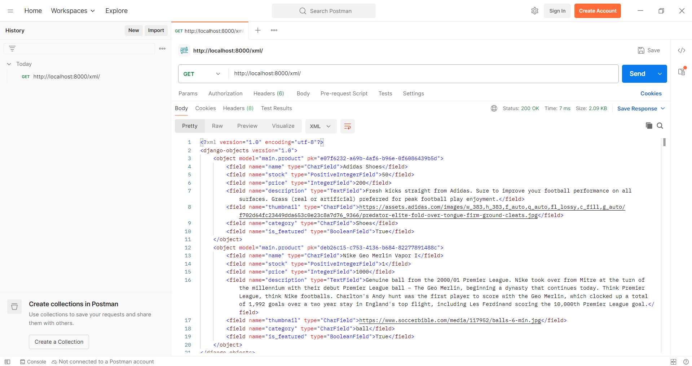
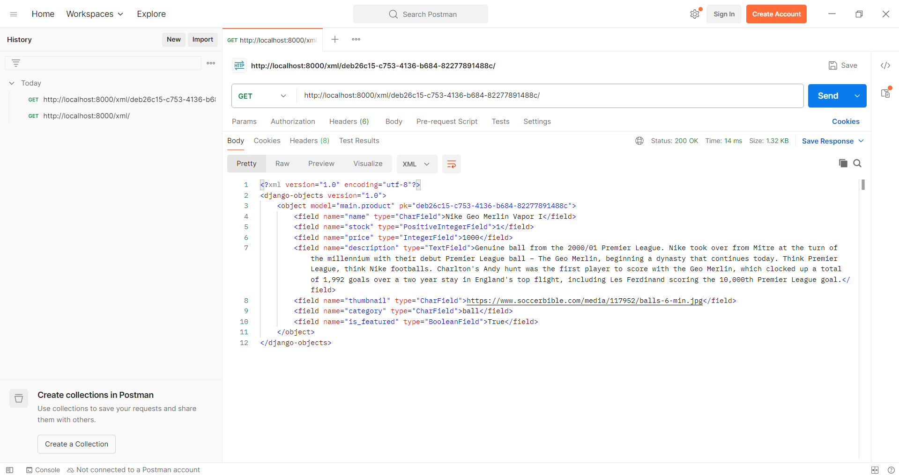
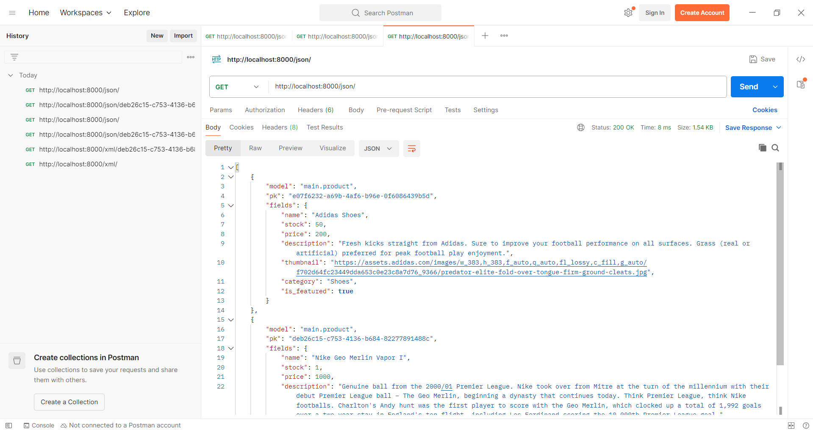
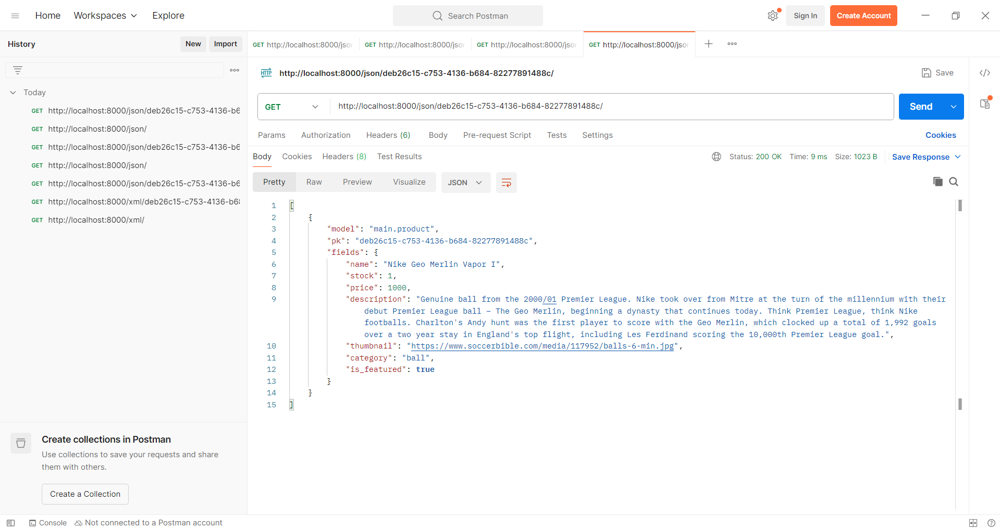

# Tasaki Shop: Misaka City's Best Football Merchandise
**URL**: https://arya-putra41-tasakishop.pbp.cs.ui.ac.id/

# Tugas 2
## 1: Jelaskan bagaimana Anda mengimplementasikan checklist di atas secara step-by-step

### Membuat sebuah proyek Django baru
Saya pertama menginisiasi folder lokal `tasaki-shop` dengan Git (`git init`). Kemudian, saya membuka *virtual environment* Python (`python -m venv env`, kemudian `env\Scripts\activate`), membuat berkas `requirements.txt` berisi nama-nama *dependency library* (termasuk Django itu sendiri, Gunicorn, dan Whitenoise), lalu menggunakan pip untuk menginstal semua *dependency* tersebut (`pip install requirements.txt`). Untuk membuka proyek Django, saya menggunakan perintah `django-admin startproject tasaki_shop .`.

Setelah membuka proyek, kita kemudian perlu mengatur *environment variable* dan mengatur opsi proyek di berkas `tasaki_shop/settings.py` untuk menggunakan variabel tersebut sekaligus mengatur *host* yang boleh menjalankan proyek kita.

### Membuat aplikasi bermama `main`
Untuk membuat aplikasi, kita menggunakan perintah `python manage.py startapp main` di folder `tasaki-shop`. Kemudian, kita mengedit `INSTALLED_APPS` pada `settings.py` untuk memasukkan `main` sebagai aplikasi yang dapat dijalankan oleh proyek `tasaki_shop`. 

### Membuat model Product
Model berupa kelas `Product` dimasukkan dalam berkas `main/models.py` dan berisi atribut seperti berikut:
- `name: CharField`
- `price: IntegerField`
- `description: CharField`
- `thumbnail: URLField`
- `category: CharField`
- `is_featured: BooleanField`
- Saya juga menambahkan atribut `stock: PositiveIntegerField`

### Membuat fungsi pada `views.py` dan membuat template
Di `views.py` saya membuat fungsi `show-main` yang memberikan variabel *context* berupa nama, NPM, dan kelas. Berikutnya saya membuat template `main.html` yang dapat diisi oleh variabel-variabel tersebut.

### Melakukan routing pada proyek
Hal ini dilakukan dengan berkas `urls.py` di `tasaki_shop` dan `urls.py` di `main`. Di `main`, kita mengonfigurasi path yang akan menjalankan fungsi `show-main` dari *views*, sedangkan di `tasaki_shop`, kita membuat path yang mengarah kepada berkas URL di main (`include('main.urls')`).
    
### Melakukan deployment ke PWS
Kita membuka proyek baru di PWS dengan nama `tasakishop`, mengatur *environment variable*, dan melakukan *deployment* melalui `git push pws master`.
  
## 2: Buatlah bagan yang berisi request client ke web aplikasi berbasis Django beserta responnya dan jelaskan pada bagan tersebut kaitan antara `urls.py`, `views.py`, `models.py`, dan berkas `html`

Silakan lihat link Canva berikut: https://www.canva.com/design/DAGyGs5w1og/V8q60vdq0ojWWiEL_knnPg/view?utm_content=DAGyGs5w1og&utm_campaign=designshare&utm_medium=link2&utm_source=uniquelinks&utlId=he395269a12

## 3: Jelaskan peran `settings.py` dalam proyek Django

Mengutip dari Django Software Foundation (2025), `settings.py` pada sebuah proyek Django (dalam hal ini `tasaki_shop`) berfungsi untuk melakukan konfigurasi-konfigurasi yang diperlukan dalam menjalankan proyek tersebut. Berikut adalah beberapa fungsi `settings.py` yang kritis atau berguna dalam menjalankan aplikasi web Django:
 - Mengatur web server yang terotorisasi menjalankan aplikasi kita melalui `ALLOWED_HOSTS`
 - Mengatur koneksi ke database di `DATABASES`
 - Mengatur berkas-berkas static (CSS, JavaScript, gambar, dsb.) di `STATIC_ROOT` dan `STATIC_URL`
 - Mengatur koneksi data cache di `CACHE`
 - Mengatur *cookies*
 - Mengatur pelaporan error dan *logging*

## 4: Bagaimana cara kerja migrasi database di Django?

Migrasi model merupakan cara Django menghubungkan perubahan yang kita lakukan pada model dengan skema data yang ada di *database* kita. Maksudnya, ketika kita mengubah model kita sedemikian rupa sehingga cara kerja *database* kita perlu berubah, migrasi bertugas untuk ikut memperbarui *database* kita untuk menerima perubahan tersebut.

Mengutip Django Software Foundation (2025), cara kerja migrasi database adalah seperti berikut:
 - Kita melakukan *command* `python manage.py makemigrations tasaki_shop` di terminal.
 - Django akan mengecek model kita, membandingkannya dengan model yang sudah disimpan sebelumnya, dan melaporkan perubahan-perubahan yang terlihat antara kedua model tersebut di terminal.
 - Django akan menciptakan *migration file* yang berisi perubahan-perubahan tersebut. Berkas ini akan disimpan di folder `migrations` di `main`.
 - Kita menginput `python manage.py migrate` untuk *commit* migrasi tersebut.
 - Jika kita *push* migrasi sekaligus dengan perubahan model, kita akan mendapatkan proyek Django dengan model yang diubah, beserta skema *database* yang telah disesuaikan untuk perubahan tersebut.

## 5: Dari semua framework yang ada, mengapa Django dijadikan permulaan pembelajaran *software development*?

Bagi saya, alasan utama Django dipilih adalah karena berdasarkan bahasa Python. Sebagai bahasa yang *interpreted* dan memiliki sintaks yang sederhana, Python cocok untuk memperkenalkan logika pemrograman kepada pemula. Selain itu, mahasiswa Fasilkom UI sudah memiliki pengalaman bekerja dengan Python melalui mata kuliah DDP 1 dan lainnya. Dasar Python ini memberikan Django keuntungan yang besar di *use case* ini dibandingkan framework lain, seperti Spring yang berbasis Java atau Laravel yang berbasis PHP.

## 6. Apakah ada feedback untuk kakak asdos dari sesi lab sebelumnya?

Kakak asdos standby di server discord PBP dan sangat cepat dalam menanggapi pertanyaan mahasiswa.

# Tugas 3
## 1: Jelaskan bagaimana Anda mengimplementasikan checklist di atas secara step-by-step

### Menambahkan fungsi *views* baru
Untuk menambahkan fungsionalitas *display* XML, JSON, XML *by* ID dan JSON *by* ID, kita perlu mengedit berkas `main/views.py`. Di berkas tersebut kita menambahkan fungsi-fungsi baru yang mentransformasi data yang ditarik dari *database* (SQLite di lokal, atau basis data PWS saat deployment) menjadi format XML dan JSON. Hal ini dilakukan dengan salah satu *interface* bawaan Django, yaitu `serializers`. Saat menampilkan seluruh data produk, kita menggunakan `serializers` untuk mengolah `product_list`, sedangkan saat menampilkan produk *by* ID, kita mengolah produk yang sesuai ID tersebut saja. Jika produk dengan ID tersebut tidak ada, akan dikembalikan laman *error* 404.

### Membuat *routing* URL
Tahap ini cukup mudah, karena kita hanya perlu sedikit perubahan yang sistematis pada `main/urls.py`. Kita mengimport keempat *view* baru yang sudah kita buat dari `main.views`, lalu menambahkan URL yang sesuai. Untuk XML dan JSON kita mengaksesnya lewat `xml/` dan  `json/`, dan untuk memfilter sesuai ID kita menambahkan ID produk yang bersangkutan ke belakang URL.

### Membuat halaman utama yang menampilkan data objek model dan akses form
Saya mengintegrasikan halaman ini ke dalam `main.html`. Sebelumnya saya perlu mengedit model saya untuk menambahkan atribut `id` yang berupa UUID. Setelah itu, saya membuat *for loop* yang melakukan iterasi pada daftar produk untuk menampilkan informasi seperti:
- nama produk,
- kategori produk,
- stok yang tersedia,
- status *featured*,
- harga produk,
- gambar *thumbnail* produk, dan
- deskripsi produk, dengan tombol untuk menuju halaman detail produk (templat `product_detail.html`).

Selain itu, saya juga membuat tombol berupa *link* ke laman formulir untuk mendaftarkan produk baru (templat `create_product.html`).

### Membuat halaman formulir
Untuk membuat halaman formulir, kita terlebih dahulu mendefinisikan isi formulir yang perlu dibuat dengan membuat berkas baru `main/forms.py`. Di dalam *file* tersebut, kita menggunakan kelas bawaan `django.forms` yaitu `ModelForm` untuk merancang isi formulir sesuai dengan model `Product` yang sudah kita buat.

Kemudian, kita perlu membuat fungsi baru di `main/views.py` yang berfungsi menampilkan formulir tersebut. Setelah mengimpor formulir yang kita buat di `forms.py`, kita membuat fungsi `create_product` yang menampilkan laman web berisi formulir tersebut sekaligus menyimpan dan memproses isi formulir ketika sudah di-*submit*. 

Tentu saja, agar laman web tersebut dapat ditampilkan, kita harus membuat *template*-nya terlebih dahulu. Di `main/templates`, kita membuat *file* baru `create_product.html` yang menggunakan Django untuk menampilkan formulir yang sudah kita buat secara otomatis dalam bentuk tabel. Di sana kita juga menambahkan `csrf_token` yang berfungsi untuk menjamin keamanan situs web kita dari serangan yang mungkin terjadi lewat formulir.

Terakhir, di `main/urls.py` kita menambahkan *routing* baru yang akan memanggil *view* yang sudah kita buat.

### Membuat halaman detail produk
Untuk membuat halaman detail produk, kita dapat menggunakan informasi yang sudah ditampilkan pada halaman *main*, seperti nama, kategori, stok, status *featured*, harga, gambar, dan deskripsi. Namun, perbedaannya adalah kita hanya memanggil informasi satu produk saja dan deskripsi produk ditampilkan secara penuh. Kita juga menambahkan satu tombol untuk kembali ke halaman *main*. Semua ini kita masukkan ke dalam *template* baru, yaitu `product_detail.html`

Tahapan lain serupa dengan yang kita lakukan saat menambahkan halaman formulir. Di *view*, kita memanfaatkan fungsi `get_object_or_404` untuk mengambil produk yang sudah dibuat menggunakan ID, dan untuk itu pada *view* dan *routing* URL kita memasukkan parameter berupa ID produk. ID produk ini akan diperoleh ketika kita menekan tombol detail produk di halaman utama, karena melalui antarmuka Django kita dapat melakukan *passing* ID produk yang sedang ditampilkan ke fungsi detail produk di *view*.

## 2. Mengapa kita memerlukan *data delivery* dalam mengimplementasikan platform?
Sederhananya *data delivery* adalah proses memindahkan data dari satu tempat atau sistem ke tempat lain. Cukup jelas bahwa perpindahan data pasti dibutuhkan dalam membuat sebuah *platform*. Misalnya, untuk sebuah *platform e-commerce*, perpindahan data diperlukan dalam:
- Mendaftarkan produk yang dijual pengguna ke server
- Menyampaikan data pembayaran pengguna ke server untuk kemudian diproses (melalui bank atau penyedia jasa lainnya)
- Memberikan notifikasi kepada user tentang status pembelian dan pengiriman
- Memberikan data pesanan kepada penjual ketika produk dibeli
- Mengimplementasikan kupon dan diskon
- Menciptakan algoritma rekomendasi produk yang mungkin disukai pengguna berdasarkan data pembelian sebelumnya, dan masih banyak lagi.

Terkadang, kita membutuhkan format data yang terstandardisasi untuk mempermudah penyortiran dan pengolahan data. Django mendukung kebutuhan ini dengan menyediakan antarmuka `serializers` yang dapat mengubah model Django menjadi format XML, JSON, dan lainnya.

## 3. Mana yang lebih baik antara JSON dan XML?
Banyak sumber menulis bahwa JSON lebih populer daripada XML, dan saya pribadi setuju dengan hal ini. Ada beberapa alasan mengapa saya lebih senang menggunakan format JSON daripada format XML:
- JSON lebih mudah dibaca. XML dibangun dari tata bahasa HTML, tetapi dengan setiap *tag* mewakili objek atau atribut objek seperti `<person>`, `<name>`, dan `<age>` alih-alih bagian laman web seperti `
`, ``, atau `<table>`. Sayangnya format ini juga membawa kelemahan, yaitu perlunya tag di awal dan akhir setiap data. Tag-tag ini bisa cukup merepotkan dan membuat data XML menjadi sulit dibaca ketika banyaknya data menyebabkan tag dan atribut masing-masing tag berbaur menjadi satu. Sebaliknya, JSON didesain menyerupai sintaks OOP pada JavaScript meskipun sebenarnya berupa format teks (tidak spesifik pada JS), yaitu berupa *key-value pair*. Delineasi masing-masing data dengan tanda kutip, titik dua, dan tanda kurung menyebabkan batasan antarobjek lebih mudah dilihat dan format dokumen menjadi lebih rapi. 
- JSON lebih padat dan hemat memori. Kebutuhan tag pada XML artinya banyak memori yang perlu dikorbankan untuk menyimpan metadata, seperti nama *field* dan tipe isi *field* tersebut (apakah angka, teks, boolean atau lainnya). Karena JSON memisahkan antardata dengan lebih intuitif dan dengan jumlah karakter yang lebih sedikit, kebutuhan memori yang diperlukan untuk menyimpan data JSON lebih kecil.
- JSON lebih mudah diolah. Data XML harus diproses dengan menggunakan program khusus (XML *parser*) dan memerlukan iterasi melalui XML DOM untuk mengambil dan menyimpan nilai-nilai variabel yang ada. Di sisi lain, JSON dapat diolah oleh fungsi JavaScript biasa yang dapat langsung menghasilkan sebuah objek yang dapat digunakan.

## 4. Jelaskan fungsi dari method `is_valid()`
Mengutip dokumentasi Django (Django Software Foundation, 2025), setiap objek `Form` termasuk `ModelForm` memiliki method `is_valid()`. Method ini akan mengecek apakah formulir tersebut siap dikirim atau tidak dengan memeriksa seluruh data pada formulir. Jika semua data valid, data tersebut akan dimasukkan ke dalam atribut `cleaned_data` milik `Form` tersebut, yang berupa *dictionary*. Selain itu, jika data sudah divalidasi, maka data dapat disimpan ke *database* melalui method `save()`.

Metode ini diperlukan untuk memastikan bahwa formulir sudah siap untuk dikirim, yaitu semua data yang perlu diisi sudah diisi dan dengan tipe data yang tepat. Sebagai contoh, method `is_valid()` akan mencegah kita mendaftarkan produk baru yang tidak punya nama. Secara otomatis, semua atribut objek yang dikaitkan ke `ModelForm` bersifat wajib diisi, tetapi kita bisa mengaturnya agar tidak wajib diisi dengan `blank=True` dan/atau `null=True`.

## 5. Apa fungsi dari `CSRF_token`?
CSRF token merupakan langkah pertahanan Django terhadap salah satu tipe serangan siber, yaitu *Cross Site Request Forgery* (CSRF). Dalam serangan CSRF, pihak yang tidak bertanggung jawab menggunakan identitas akun pengguna untuk mengirimkan *request* kepada situs lain yang tidak sesuai keinginan pengguna. Karena pengguna sudah login dan terotentikasi, situs tidak bisa membedakan *request* yang dikirim oleh user dengan yang dikirimkan oleh pihak lain yang "mengaku-ngaku" sebagai si user. Serangan CSRF dapat digunakan untuk memanfaatkan akun pengguna dan wewenang-wewenang yang mungkin dimilikinya, misalnya mengirimkan dana dari rekening bank pengguna yang sedang login di situs *online banking*. Salah satu target yang sering dicari dalam serangan CSRF adalah formulir-formulir yang dapat mengubah *database* aplikasi.

Untuk melindungi *form* aplikasi web kita dari serangan CSRF, Django memasukkan sebuah entri pada formulir yang tidak dapat dilihat user, yaitu `csrfmiddlewaretoken`. Untuk mengisi entri ini, user perlu memiliki *cookies* CSRF yang hanya dapat diperoleh dari aplikasi web kita saat login (tidak dari situs lain). Pada formulir kita mendapatkannya dengan `` di `create_product.html`. Apabila kita tidak memiliki token yang tepat saat mengirim formulir, akan terjadi error 403 *Forbidden*.

## 6. Apakah ada feedback untuk asdos di tutorial 2?
Asdos menulis dokumen tutorial 2 dengan sangat jelas dan lugas. Saya juga suka adanya Penjelasan Kode untuk poin yang mungkin baru bagi mahasiswa, meskipun menurut saya penjelasan tersebut bisa lebih diperluas lagi.

## Postman

## Referensi Tugas 3:
Django Software Foundation. (2025). Dokumentasi Django versi 5.2. Diakses dari https://docs.djangoproject.com

"JSON vs XML". W3Schools. Diakses dari https://www.w3schools.com/js/js_json_xml.asp

KirstenS. *Cross Site Request Forgery (CSRF)*. Open Worldwide Application Security Project. Diakses dari https://owasp.org/www-community/attacks/csrf

# Tugas 4
## 1. Jelaskan bagaimana anda mengimplementasikan checklist di atas secara step-by-step

### Mengimplementasikan fungsi registrasi, login, dan logou
Untuk membuat **registrasi**, kita harus terlebih dahulu membuat *view* pada `main/views.py` yang akan membantu kita menampilkan, menyimpan, dan mengolah *form* registrasi, sama seperti yang kita lakukan dengan *form* pembuatan produk sebelumnya. Formulir bawaan Django (pada *library* `django.contrib.auth.forms`) yang akan membantu kita membuat formulir registrasi adalah `UserCreationForm`. Dengan ini, kita bahkan tidak perlu merancang form pada `main/forms.py` seperti pada pembuatan produk; Django sudah otomatis membuatkan formulir pendaftaran untuk kita.

Namun, kita pastinya perlu tampilan yang dapat dilihat user untuk menyajikan formulir registrasi kita. Kita membuat template baru di `main/templates` yaitu `register.html`. Di sini kita menggunakan cara `form.as_table` yang sama dengan formulir pembuatan produk, tetapi kita juga menambahkan *space* untuk pesan (*messages*) yang mungkin dikirimkan oleh sistem, misalnya memberi tahu user apakah registrasinya berhasil atau gagal. 

Membuat **login** melibatkan langkah yang tak jauh berbeda dengan registrasi. Kali ini formulir yang digunakan di fungsi login di `views.py` adalah `AuthenticationForm` dari *library* yang sama. Selain itu, kita juga memerlukan fungsi `login` dari `django.contrib.auth`. Fungsi ini akan menyimpan sebuah kuki (HTTP *cookie*), yang akan dibicarakan lebih lanjut ke depannya. Di `main/templates`, kita membuat laman `login.html` yang meminta *username* dan *password* kita kembali. Perbedaan implementasinya dengan registrasi adalah bahwa sekarang, kita memiliki *link* ke halaman registrasi untuk pengguna yang belum memiliki akun.

Fungsi **logout** lebih sederhana, karena tidak perlu menampilkan halaman web. Kita cukup mengakhiri *session* pengguna. Oleh karena itu, fungsi *logout* pada `views.py`dapat kita implementasikan dengan mengambil fungsi `logout` dari `django.contrib.auth`.

Tidak lupa kita mengaitkan fungsi registrasi, login, dan logout ke `main/urls.py`.

Setelah itu, kita akan membatasi halaman-halaman antarmuka aplikasi (seperti daftar produk, detail produk, dan pembuatan produk) agar hanya dapat diakses oleh user yang telah login. Hal ini kita lakukan dengan mengimpor *decorator* berupa `@login_required` dari `django.contrib.auth.decorators`, lalu menambahkannya ke *view* untuk masing-masing laman tersebut. Kita juga menetapkan atribut `login_url` agar Django tahu ke mana user sebaiknya dipindahkan jika mereka belum login.

### Menghubungkan model `Product` dengan `User`
Kita perlu mengedit model `Product` kita di `main/models.py` untuk menambahkan model `User` sebagai *foreign key*. Untuk itu kita menambahkan atribut `user` pada model kita, yang menandai siapa yang mendaftarkan produk yang bersangkutan. Model `User` diimpor dari *library* bawaan Django di `django.contrib.auth.models`. 

*Foreign key* merupakan konsep dalam basis data yang artinya satu tabel (dalam hal ini, model Django) dapat memiliki atribut atau parameter yang sebenarnya berupa elemen pada tabel lainnya. Hubungan yang kita implementasikan ini menandai "pemilik" dari suatu produk sebagai *one-to-many relationship*, artinya satu pengguna dapat memiliki banyak produk. Dalam implementasinya pada *database*, ini artinya beberapa objek dalam model `Product` dapat memiliki atribut `user` yang sama, yang merujuk kepada objek yang sama di model `User`.

Di `main/views.py`, kita mengedit fungsi pembuatan produk kita agar dapat mengaitkan user ke produk. Saat mengirim formulir, kiriman tersebut akan "ditahan" dengan atribut `commit=False`. Kemudian, kita mendefinisikan atribut `user` dari produk sebagai user yang sekarang sedang login. Baru setelah itu, kita menyimpan formulir dan mengirimkannya untuk diproses di *database*.

### Menerapkan *cookie* dan menampilkan informasi pengguna
Mengimplementasikan *cookie* berarti kita perlu terlebih dahulu mendefinisikan di mana kuki (*cookie*) akan dibuat dan dihapus. Kita lakukan ini dengan mengedit fungsi login dan logout pada `main/views.py` kita. Di sini kita akan menyimpan kuki berupa `last_login`, yang berfungsi menyimpan status login kita sekaligus waktu kita melakukan login. Dengan pemahaman bahwa kuki akan dibuat (di-*update* dengan waktu terbaru) saat login dan dihapus saat logout, kita mengedit fungsi login dan logout kita di `main/views.py`. Khususnya, kita mengubah `HttpResponse` yang sebelumnya langsung dikembalikan menjadi sebuah objek, yang kemudian dapat kita operasikan dengan fungsi `set_cookie` dan `delete_cookie`.

Berikutnya, kita akan mengedit halaman utama dan detail produk untuk menampilkan informasi baru yang kita peroleh. Karena HTTP *request* sekarang memiliki informasi user yang login, kita dapat menambahkannya ke konteks yang ditampilkan pada fungsi `show_main` di `main/views.py`. Kita juga dapat menambahkan kuki yang kita buat saat login. Oleh karena itu, kita dapat mengakses kedua informasi tersebut di halaman main melalui variabel Django. Hal yang sama pun berlaku untuk produk: jika ada user yang terkait pada produk, maka kita dapat menarik data itu dari atribut produk dan menampilkannya sebagai nama penjual.

Satu lagi fitur yang ingin kita implementasikan pada aplikasi kita adalah *filtering* produk berdasarkan user. Kita lakukan ini dengan memodifikasi list produk yang ditampilkan pada halaman main. Untuk mengambil parameter yang diinginkan, kita membaca URL pada HTTP *request* yang dikirimkan, lalu menerapkannya dengan fungsi `filter` pada daftar objek `Product`. Tentu saja, user perlu bisa mengaktifkan fitur ini, sehingga kita membuat beberapa *link* pada halaman main yang akan memodifikasi URL dengan parameter yang diinginkan.

### Membuat 2 akun pengguna dan 3 dummy data per pengguna
Karena tahap ini lebih dekat dengan *functional testing*, kita dapat melakukannya tanpa mengedit kode kita lebih lanjut. Saya mendaftarkan 2 akun pengguna yang berbeda, kemudian membuat 3 produk atas nama masing-masing user tersebut.

## 2. Apa itu Django `AuthenticationForm`?
Mengutip dokumentasi Django (Django Software Foundation, 2025), `AuthenticationForm` merupakan formulir bawaan Django yang dapat diimpor dari modul `django.contrib.auth.forms`. Formulir ini digunakan untuk mengumpulkan dan mengolah data identitas user yang diperlukan untuk login, seperti username, password, dan *field-field* lainnya seperti email. Secara *default*, `AuthenticationForm` akan menolak login user yang tidak aktif (`is_active` == False). Namun, hal ini dapat dihindari dengan menggunakan subclass yang meng-*override* fungsi `confirm_login_allowed()` melalui *inheritance*.

Keuntungan menggunakan `AuthenticationForm` adalah mudah diterapkan dan dipakai. Kita tidak perlu membuat formulir kita sendiri untuk menangkap data-data yang diperlukan. Namun, `AuthenticationForm`, seperti *form-form* autentikasi lainnya di Django, hanya 100% kompatibel dengan model `User` bawaan Django. Jika kita memiliki kelas user sendiri, kita mungkin harus merubah form atau bahkan membuat form sendiri yang dapat mengakses kelas user kita.

## 3. Apa perbedaan autentikasi dan otorisasi?
Perbedaan utama antara autentikasi (*authentication*) dan otorisasi (*authorization*) adalah autentikasi memastikan keaslian identitas seorang user, sedangkan otorisasi memastikan izin-izin yang dimiliki user tersebut (Kosinski). Dalam proses autentikasi, kita menggunakan informasi yang dimiliki user, seperti username, password, email, nomor telepon, hingga biometrik seperti sidik jari atau retina mata, untuk memastikan bahwa identitas user yang sedang login sesuai dengan user yang ada dalam *database*. Beberapa cara autentikasi di atas dapat digabungkan menjadi *multi-factor authentication* (MFA). 

Adapun proses otorisasi memeriksa apakah user diizinkan melakukan aktivitas tertentu di sistem berdasarkan statusnya, misalnya membuka file, mengedit file, atau menjalankan program. Beberapa sistem membatasi otorisasi selain dari *role* pengguna, apakah user atau admin; sebagai contoh, perusahaan hanya mengizinkan akses untuk data penting di jam kerja untuk menghindari akun admin digunakan oleh orang yang tidak bertanggung jawab.

Django menyediakan *tools* yang beragam untuk menangani autentikasi pengguna, yang terkandung di dalam modul `django.contrib.auth`. Berpusat pada model `User`, Django menyediakan formulir `AuthenticationForm` dengan username dan password, kendali login dan logout, penyimpanan sesi user melalui *cookie*, dan pengelompokan user menjadi grup dengan perizinan yang berbeda. Otorisasi masing-masing grup dan user dapat dimodifikasi, memberikan mereka izin melihat, menambahkan, menghapus, dan mengedit file. Satu cara yang paling sederhana adalah dengan *decorator* `@login_required` pada *view* yang melarang user yang belum login mengakses halaman tertentu.

## 4. Apa kelebihan dan kekurangan menggunakan *session* dan menggunakan *cookies*?
*Cookie* dan *session* merupakan dua cara aplikasi web dapat mewujudkan *holding state*, atau membawa informasi dari satu laman web ke laman yang lain. 

*Cookie* disimpan pada browser pengguna dan akan dikirimkan kembali ke server setiap kali kita melakukan HTTP *request*. Cookie hanya cocok untuk menyimpan data yang berukuran kecil, karena batas ukuran cookie hanya 4 KB. Data dalam cookie juga dapat mudah diakses oleh pengguna (hanya melalui *inspect element*) sehingga keamanannya tidak terjamin. Namun, kedaluarsanya sebuah cookie dapat diatur bebas oleh programmer, sehingga kita dapat mengatur berapa lama data akan disimpan. Kompatibilitas cookie juga luas, karena implementasi cookie sudah dilakukan pada browser sejak pertengahan tahun 1990-an.

*Session* disimpan pada server dan menyimpan informasi pengguna yang sedang login. Kelebihan menggunakan sistem session adalah kemampuan menyimpan data dalam jumlah lebih besar daripada cookie dan lebih aman karena disimpan secara *server-side*. Akan tetapi, session akan kedaluarsa saat proses aplikasi yang sedang berjalan ditutup, atau kedaluarsa secara otomatis saat user tidak aktif (hal inilah yang menyebabkan error *session expired*). Menarik data dari session juga lebih lambat daripada cookie karena browser perlu mengirimkan request ke server untuk mengambil data tersebut.

## 5. Apakah menggunakan *cookie* berisiko? Bagaimana Django menangani hal tersebut?
Seperti yang telah dijelaskan pada poin sebelumnya, data pada *cookie* tidak sepenuhnya aman karena tersimpan di browser, sehingga mudah diakses oleh user. Pencurian cookie juga dapat terjadi jika pelaku serangan siber menyadap komunikasi antara server dan browser, atau melalui serangan *cross-site* seperti XSS dan CSRF. 

Untuk menjamin keamanan *cookie*, Django menawarkan opsi `SESSION_COOKIE_SECURE` dan `CSRF_COOKIE_SECURE` yang dapat diakses dari `settings.py` untuk app Django. Opsi ini masing-masing mengatur cookie penyimpanan sesi user dan cookie CSRF. Jika kita mengaktifkan kedua pilihan ini, Django akan memastikan bahwa kedua cookie tersebut hanya dapat dikirimkan melalui koneksi HTTPS yang terenkripsi, alih-alih koneksi HTTP. Adanya kewajiban HTTPS ini dapat melindungi cookie dari penyadapan dan serangan *man-in-the-middle*. Namun, meskipun sudah ada bantuan keamanan dari Django, kita harus tetap sadar terhadap keamanan data cookie saat merancang aplikasi web kita.

## Referensi Tugas 4:
"Difference Between Session and Cookies". GeeksForGeeks. Diakses dari https://www.geeksforgeeks.org/javascript/difference-between-session-and-cookies/
Django Software Foundation. (2025). Dokumentasi Django versi 5.2. Diakses dari https://docs.djangoproject.com
Kosinski, Matthew. *Authentication vs. authorization: What's the difference?*. IBM Think. Diakses dari https://www.ibm.com/think/topics/authentication-vs-authorization